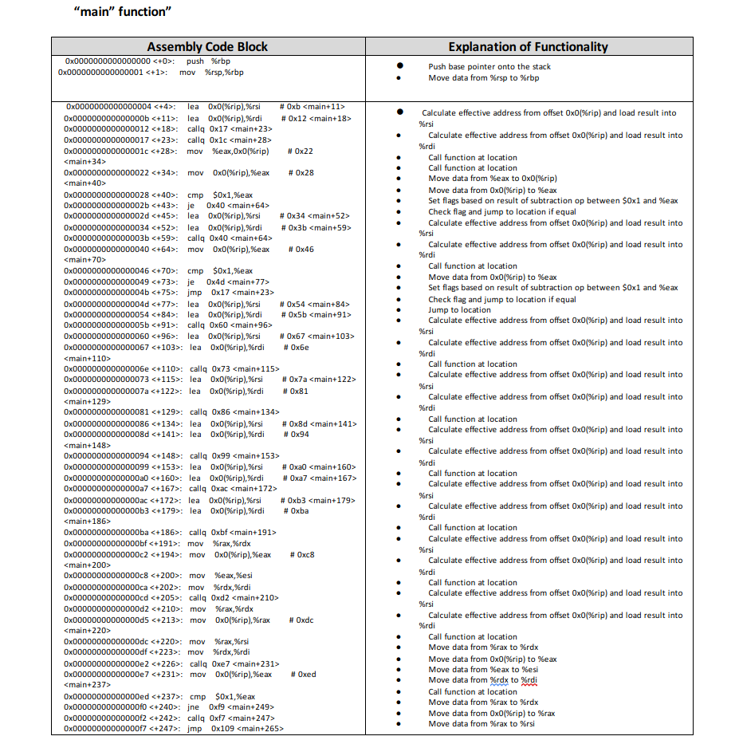
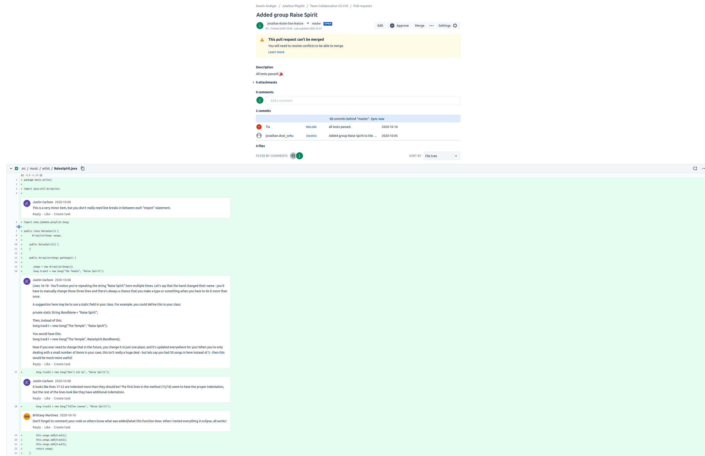
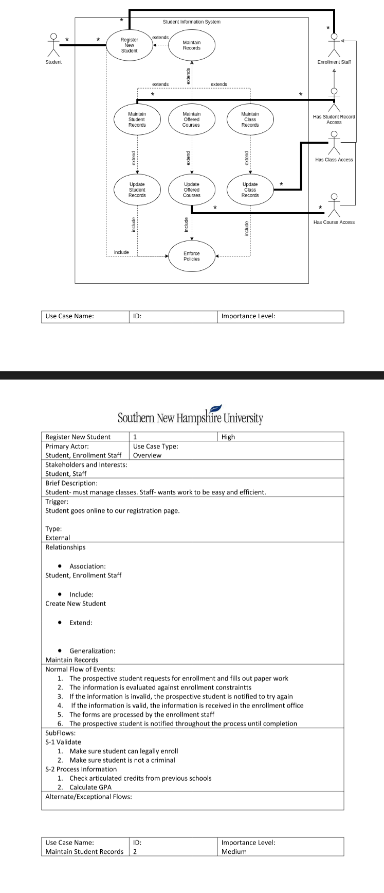
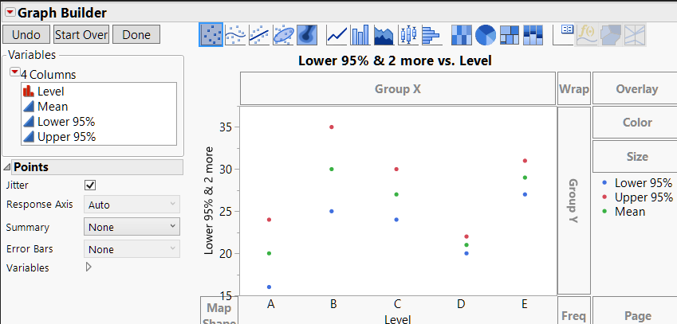

# **ePortfolio**

# Self-assessment

Thank you for taking the time to review my software engineering ePortfolio. Throughout completing coursework in the Southern New Hampshire University program I learned many fundamental computer science concepts. These concepts include but are not limited to Understanding software design and engineering techniques, declaring and implementing data structures in algorithms, and databases and security. 


In regards to software engineering, I was presented keep concepts like reverse engineering and program security. Here’s an example Of part of a deliverable I sent where I interpret an Executable program by converting it to it’s Intel IA-32 instruction set using Gnu Debugger (GDB). 




I also learned about communicating and collaborating with teams using distributed version control systems (DVCS). 



As far as design, I learned how to reproduce the unified process by planning a project with stakeholders, project management and various types of software development life cycles with various types of customer research, researching and analyzing the state of systems, and officially articulating those plans into the code:



with databases I learned how information is distributed using different database engines and analyzing that information using data analysis techniques and programs like JMP by Microsoft



As for algorithms I learned about scheduling tasks with hardware devices, here is an example of Micro controlling this LED lightbulb that receives signals through The motherboards data bus:


# Code Review
[Code Review Video](https://youtu.be/qXqJZ667FPk)

# Artifact
[Spinventory Android Application Code](https://www.dropbox.com/s/h7z8dy6m2qynr9w/spinventory%20.zip?dl=0)

Here’s an artifact I created in October 2020. It is an android application I named Spinventory. I selected this artifact for my computer science capstone because android applications encompass many different aspects of computer science within one device. Specifically for my application, The target user that I would expect to adopt it is an operations manager at a retail store. 


The functional requirements were to be able to: Login to the application, add an inventory product with its name item ID, brand. Different components were necessary to accomplish this application, and it serves as a framework for what could be a much larger application. 
After working on this application for a project and enhancing it later, I learned a lot about how an android application is managed (code, dependency management, application signing, avoiding memory leaks and other security concerns. As I was improving the application, I learned a lot from updates I made an feedback I received. 


In my feedback, I understood that my goals to upgrade the quality of the application should be focused on these three fundamental computer science concepts: software design and engineering, algorithm and data structures, databases.


One of those updates is the encryption of user passwords with class and implementation:

```
package com.spinventory;

import java.security.MessageDigest;
import java.security.NoSuchAlgorithmException;

public class Utils {
    public static class Hash {
        public static String it(String text) {
            MessageDigest messageDigest = null;
            try {
                messageDigest = MessageDigest.getInstance("SHA-256");
            } catch (NoSuchAlgorithmException e) {
                e.printStackTrace();
                return "";
            }
            messageDigest.update(text.getBytes());
            return new String(messageDigest.digest());
        }
    }
}
```

User.java
 ```
     public void setPassword(String p) {
        Utils.Hash hasher = new Utils.Hash();
        password = hasher.it(p);
    }
 ````
 
 
The challenge with this task was first deciding whether I wanted to implement my own encryption by implementing a hash function (XOR, mod, multiplicative,...)  or use a library. I learned after research that I am not meant to implement my own encryption in my programs unless I really know what I am doing and specialize in encryption, which I do not. Therefore I used a built in library instead. 


Another update I made was to my database management when it comes to local storage on the device. I learned about object relation management (ORM) and how it relates to code via interfaces end class methods. I saw how Collections lists and other abstract data structures can be manipulated. The following Room entity Interface, Data Access Interface, and Class illustrate this:

UserDao.java
```
package com.spinventory.dao;

import androidx.room.Dao;
import androidx.room.Insert;
import androidx.room.OnConflictStrategy;
import androidx.room.Query;

import com.spinventory.entities.InventoryItem;
import com.spinventory.entities.User;

import java.util.List;

@Dao
public interface UserDao {

    @Query("SELECT * FROM users WHERE username = :username LIMIT 1")
    public User getUserByUsername(String username);

    @Query("SELECT * FROM users")
    public List<User> getUsers();

    @Insert(onConflict = OnConflictStrategy.ABORT)
    public void insertUser(User user);

    @Query("DELETE FROM users")
    public void removeAllUsers();

}

```

UserDatabase
```
package com.spinventory.databases;

import android.content.Context;
import androidx.room.Database;
import androidx.room.Room;
import androidx.room.RoomDatabase;

import com.spinventory.dao.UserDao;
import com.spinventory.entities.User;

@Database(entities = {User.class}, version = 1)
public abstract class UsersDatabase extends RoomDatabase {

    private static final String DATABASE_NAME = "users.db";

    private static UsersDatabase mUserDatabase;

    // Best practice
    // Use a singleton to access 1 instance of our inventory database to interact with it
    public static UsersDatabase getInstance(Context context) {
        if (mUserDatabase == null) {
            mUserDatabase = Room.databaseBuilder(context, UsersDatabase.class,
                    DATABASE_NAME).allowMainThreadQueries().build();
        }
        return mUserDatabase;
    }

    public abstract UserDao userDao();
}
```

User.java
```
package com.spinventory.dao;

import androidx.room.Dao;
import androidx.room.Insert;
import androidx.room.OnConflictStrategy;
import androidx.room.Query;

import com.spinventory.entities.InventoryItem;
import com.spinventory.entities.User;

import java.util.List;

@Dao
public interface UserDao {

    @Query("SELECT * FROM users WHERE username = :username LIMIT 1")
    public User getUserByUsername(String username);

    @Query("SELECT * FROM users")
    public List<User> getUsers();

    @Insert(onConflict = OnConflictStrategy.ABORT)
    public void insertUser(User user);

    @Query("DELETE FROM users")
    public void removeAllUsers();

}
```


Room is one of the most popular local database management tools for android. 
As far as current security goes, I had learned about the risks of miss handled character strings from my secure coding in C/C plus plus class and reverse engineering class. With this knowledge, I understood why the android platform suggest using the strings.xml template. So I made this update as well:

strings.xml
```
<resources>
    <!-- Data Access Statements -->
    <string name="sql_statement_select_all_company">SELECT * FROM company</string>

    <!-- app -->
    <string name="app_name">Project</string>
    <!-- Strings related to login -->
    <string name="prompt_email">User Name</string>
    <string name="prompt_password">Password</string>
    <string name="action_sign_in">Sign in or register</string>
    <string name="action_register">Register</string>
    <string name="action_sign_in_short">Sign in</string>
    <string name="welcome">"Welcome !"</string>
    <string name="invalid_username">Not a valid username</string>
    <string name="invalid_password">Password must be >5 characters</string>
    <string name="login_failed">"Login failed"</string>
    <string name="title_activity_manage_inventory_items">ManageInventoryItems</string>
    
</resources>
```
